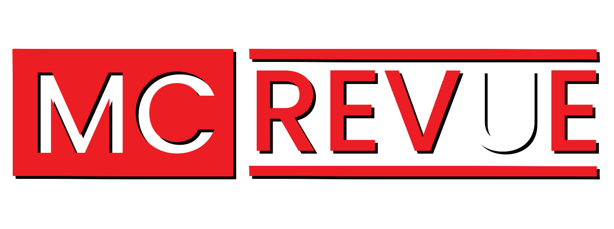

View live project [here:](https://m-c-re-vue.herokuapp.com/)

MC REVUE is a Movie information and review website dedicated to the Marvel Cinematic Universe.
Its name itself is a play on the MCU acronym used by Marvel and its fans for the Marvel Cinematic Universe.

This is the third of four Mile Stone Projects.

The brief was to build an interactive front-end site that responds to users' actions, allowing them to actively engage with data, alter the way the site displays the information to achieve their preferred goals.


## Mock Up

## User Experince
### New User
- View Movie and Television reviews
- Create an account to register reviews.
- Create movie and Television reviews for MCU Movies and Televison Shows

### Returning User
- Create reviews for MCU products viewed
- View reviews for MCU products.
- Edit and delete personal reviews for MCU products 

### Company Goal
- Users can create accounts
- Users create reviews for MCU products released
- Users can access reviews made by other users for MCU products.
- Users can amend and delete personal reivews for the MCU Products
- Administrators (Admin) can edit MCU product information to keep it up to date 

## Design
### Wireframes
- Wireframes can be found [here](wireframes.md)


### Database Structure

### Security
During development sensitive data, such as database configuration variables, were saved in an env.py file. This file is not uploaded to GitHub for security purposes. These details are stored on Heroku once the site has reached the deployment stage.

The users accounts are protected with password hashing avaialble via Werkzeug.


### Colour schemes
The Colour Scheme of the website is inspired by Marvel Entertainment's colour scheme
- Red - #ED1D24 - This is the same Hexcode used as by Marvel in thier main brand logo be it for Comics or Movie/TV
- Blue - #4682B4 - This blue is used by Marvel for the superheroe team "The Fantastic Four" and is used to show the opposite commands for the buttons project wide
- Yellow - #FBCA03 - This yellow is commonly found in Iron Man projects in Marvel lore. This colour is only seen by Admin and is specific for Admin Tasks such as editing project information.
- Black and White  - #000000 #FFFFFF are set via Materialize CSS


### Typography 
"Poppins" - 

"Marvel" - is a complimentary font to "Poppins" and is more inkeeping with the Marvel Studios product.

### Imagery
Majority of the imagry featured in the project comes from Marvel Entertainment and marvel Studios as Theatrical Poster Art or logos used to announce projects at ComicCon 2020 or at a Disney investor event of 2020.
Logos for the website "MC REVUE" and "Pan Industries" were created by myself
- MC REVUE:
    - This is a spin on the Marvel Studios logo with the "U" in white to signal the MCU acronym commonly used for the Marvel Cinematic Universe.
- Pan Industires
    - This is a play on the HTML Paragraph syntax with a pseudo name for myself (Captain Pan) alongside one of the commonly used company names found within Marvel lore 


### Languages Used
HTML
CSS
Javascript - JQuery
Python

## Frameworks used
- [Balsamiq:](https://balsamiq.com/)
    - Balsamiq was used to create the wire frames for design.
- [Font Awesome:](https://fontawesome.com/)
    - Font Awesome was used for a range of font based images found throughout the project.
- [favconit:](http://faviconit.com/en)
    - Favconit was used to build and code the favcons that feature on the project.
- [Git:](https://git-scm.com/)
    - Git was used for version control by utilizing the Gitpod terminal to commit to Git and Push to GitHub.
- [GitHub:](https://github.com/)
    - GitHub is used to store the projects code after being pushed from Git.
- [Google Fonts:](https://fonts.google.com/)
    - Google Fonts provided the code for the fonts used throughout the project.
- [Heroku:](https://heroku.com/)
    - Heroku was used as the platform as a service (PaaS) to build, run, and operate applications entirely in the cloud
- [Materialize CSS:](https://materializecss.com/)
    - Materialize CSS was used to assist with the responsiveness and styling of the website.
- [MongoDB:](https://www.mongodb.com/) 
    - MongoDB was used to create the database used throughout the project.
- [Procreate:](https://procreate.art/) 
    - Procreate was used to create the visuals for the art used throughout the project.
- [Werkzeug:](https://werkzeug.palletsprojects.com/en/2.0.x/)
    - Werkzeug is a comprehensive WSGI web application library. It began as a simple collection of various utilities for WSGI applications and has become one of the most advanced WSGI utility libraries.

## Testing
HTML was directly input into [WC3](https://validator.w3.org/)

CSS was directly input into [W3c Jigsaw](https://jigsaw.w3.org/css-validator/)

Javascript was directly input into [JSHint](https://jshint.com/)

Python was run with [Pylint](https://pypi.org/project/pylint/) in the terminal, the code is PEP8 compliant.

## User goals
### New User
- Create reviews for MCU products viewed
    - Users are able to easily create accounts to review MCU Telvision and Movie 
- View Movie and Television reviews
    - Users can view reviews of Television Shows and Movies.
- Create movie and Television reviews for MCU Movies and Televison Shows
    - Users can create reviews for Television Shows and Movies.

### Returning User
- Create reviews for MCU products viewed
    - Users can create reviews for MCU products
- View reviews for MCU products.
    - users can see a variety of reviews fo MCU Products however this is done with a NUmber rating - not the 5 stars used in creating the review.
- Edit and delete personal reviews for MCU products
    - Users can edit and and delete personal reviews for MCU products

### Company Goal
- Users can create accounts
    - Users can create aand log into individual accounts
- Users create reviews for MCU products released
    - Users can only review MCU prodcts that have be released
- Users can access reviews made by other users for MCU products.
    - Users can see reviews made by other users relevant to the movie/tv show being viewed
- Users can amend and delete personal reivews for the MCU Products.
    - Users are able to edit personal reviews should thier opinions chnge over time.
- Administrators (Admin) can edit MCU product information to keep informaton up to date
    - Through the admin profile administators have the power to create and edit MCU product information as and when required.


### Further Testing
Website was tested on a variety of browsers including Google Chrome, Safari, Firefox, And Edge.
The website was viewed on a variety of devices including desktop, laptop and mobile on both iOS and Android operating systems.
Through the Twitch community of Warwick Zero, whom featured during Mile Stone Project 2 - Interactive Front End - the community have again been gracious enough to assit in testing the project throughout its development. Thier various levels of attention to details and personally knowing thier honesty has enabled open and flowing communication of what they beleive is going well and not. This included:
- The addition of other colours - including the blue to provide a clear visual difference between buttons for action and buttons for cancelling actions.
- Differentiation in Images used for Television shows and th Movies -Their testing resulted in changes to the Movies page with upcoming movies without theatrical posters being given the same size poster but with the released logo on black backgrounds - This was a similar design used solely for the Television Shows and provides a clear visual difference between the movie and TV sections of the applciation.

### Problems
- Trying to workout how to include images in Mongo DB
    - This was worked around by inserting a movie/television show  specific "codeword" in Mongo DB which aligned with the images filename added to the repository.

- Getting a Visual 5 star rating system controlled by JQuery to place information in the database upon submission of the review form.
    - Through discsssion with Antonio, my mentor, I included a hidden input that recorded the information printed to the console when clicking the stars from the Javascript/JQuery file.


### Further Development
- With greater undestanding and confidence in my abilities I would have liked to find ways to get the rating system to show up in readable reviews as stars. however due to limitations and time this was unable to be completed. 
- With a more confident approach I would have like to include a search feature so that should users want to find information quickly about one particular character, or Marvel projects with the same character attached this would have been done.


## Bugs
All images stored in the Static/Images folders Images not showing in both movie and television show information pages with the error code 404 emerging. - This was corrected and was a result of oversight. /static/images/... location.

On occasion the project has instanced in TV Programmes where the buttons Revue and View fall outside of the card to whihc they are written. No matter how I tried to correc tthe problem- something always went wrong.

## Deployment
### Heroku
"Heroku is a container-based cloud Platform as a Service (PaaS). Developers use Heroku to deploy, manage, and scale modern apps" Before you deploy to Heroku you will need to add a requirements.txt file and a Procfile to your application. Heroku needs both of these files to run, they must be pushed to the repository on GitHub.

To deploy your application to Heroku

1. Go to Heroku.com and login or create and account.
2. Your dashboard should open and there will be a 'New' button on the top-right of the screen, select this.
3. Select 'Create New App' from the buttons drop down menu
4. Add your app name (it must be unique, lowercase with a dash used instead of spaces)
5. Select the region closest to you and click create app
6. You will then need to connect your GitHub Repository, in the deploy tab, under method, select "Connect to GitHub".
7. Connect your GitHub account, ensure the correct profile name is displayed
8. Then add your repository name, search and select the correct repository
9. Open the settings tab and select 'Reveal Config Vars'
10. You will need to add here, any secret or hidden variables that are not visable to Heroku from your GitHub repository.
>    - IP : "0.0.0.0"
>   - PORT : "5000"
>    - MONGO_DBNAME : "(Insert the database name you wish to connect to)"
>   - MONGO_URI : "(Insert URI)" - The URI can be found on MongoDB under Clusters, "Connect" > "Connect your application" and replacing the generic values with your user name and password
>   - SECRET_KEY : "(Insert custom secret key you created in configuration to keep the sessions secure)
11. Hide Con Fig Vars and reopen the deploy tab
12. Under automatic deployment enable automatic deployment
13. In manual deploy section select the branch you wish to deploy from the drop down and click deploy branch
14. This will take a few moments, once complete and option to view the live app will appear

### Forking the GitHub Repository

By forking the GitHub Repository we make a copy of the original repository on our GitHub account to view and/or make changes without affecting the original repository by using the following steps...

1. Log in to GitHub and locate the [GitHub Repository](https://github.com/)
2. At the top of the Repository (not top of page) just above the "Settings" Button on the menu, locate the "Fork" Button.
3. You should now have a copy of the original repository in your GitHub account.

### Making a Local Clone

1. Log in to GitHub and locate the [GitHub Repository](https://github.com/)
2. Under the repository name, click "Clone or download".
3. To clone the repository using HTTPS, under "Clone with HTTPS", copy the link.
4. Open Git Bash
5. Change the current working directory to the location where you want the cloned directory to be made.
6. Type `git clone`, and then paste the URL you copied in Step 3.

```
$ git clone https://github.com/YOUR-USERNAME/YOUR-REPOSITORY
```

7. Press Enter. Your local clone will be created.

```
$ git clone https://github.com/YOUR-USERNAME/YOUR-REPOSITORY
> Cloning into `CI-Clone`...
> remote: Counting objects: 10, done.
> remote: Compressing objects: 100% (8/8), done.
> remove: Total 10 (delta 1), reused 10 (delta 1)
> Unpacking objects: 100% (10/10), done.
```

Click [Here](https://help.github.com/en/github/creating-cloning-and-archiving-repositories/cloning-a-repository#cloning-a-repository-to-github-desktop) to retrieve pictures for some of the buttons and more detailed explanations of the above process.

## Credits
### Media
- [Marvel Studios](https://innersloth.com/gameAmongUs.php) 

### Sources
General sources of information for structure functionality and styling.

[MDN Web Docs](https://developer.mozilla.org/en-US/)
[W3 Schools](https://www.w3schools.com/js/default.asp)
[Stack Over Flow](https://stackoverflow.com/)

Code Institute, Full Stack Development course material.


### Acknowledgements

-  My Mentor Antonio Rodriguez for helpful feedback, advice and much needed guidance along a difficult path.
-  Tutor support at Code Institute for their support.
-  My family for thier continual feedback and honest critique, thier support and love (Even Liwsi and your sleepless nights, and Evie the Cockapoo pup) - Moving house during this project hasn't made it any easier on any of us and you've dealt with an absent father/husband when I've gone to 'work'.
-  The streaming community of [Warwick Zero](https://twitch.tv/warwickzero) you have bouyed a tired "Pan" and allowed him to soar when worries of deadlines and errors got frustraitingly high.

### Final Thoughts
This project has been one of the hardest tests I've ever experienced. I have sat through hours of youtube tutorials, on top of multiple re-watches of the entire module leading into the project. I have spent days looking at singular problems with no way forward, at several points during the process I have considered quitting the course completely due to the negative impact it was having on my mental health and personal  well-being. Whilst this may not be perfect or as I originally wanted and intended but it is the best that I can currently provide with my limited experience in Javascript. The deployed and submitted project is a personal triumph for myself and watching the reactions from the community of streamer "Warwick Zero" with the negativity I was experiencing around the build has made me realise I am capable, I can deliver - it might take me a little longer on occasion- but I can get it done, and not to place too much pressure on myself.# Impostor Hunt
